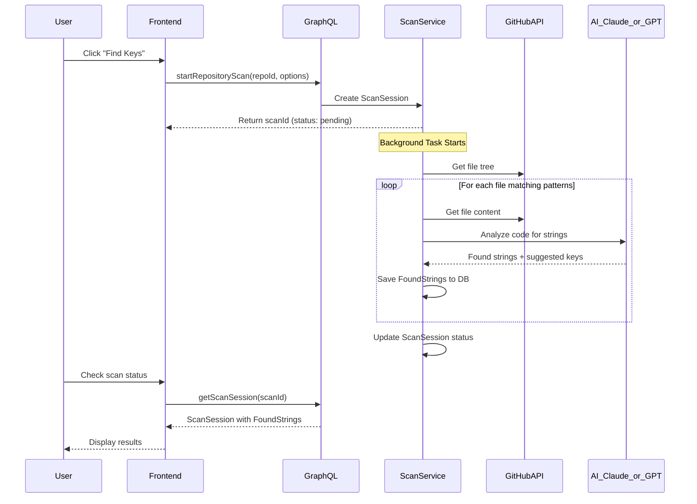

# Repository Key Scanner - Plan

## Overview

Добавление функции автоматического сканирования GitHub репозитория для поиска hardcoded строк. AI (Claude или GPT на выбор) анализирует код, находит строки без i18n, предлагает названия ключей. Результаты сохраняются как черновики для последующего одобрения.

## Architecture




## Data Models

### ScanSession

Хранит информацию о сессии сканирования:

- `id`, `public_id`
- `repository_id` - связь с Repository
- `status` - PENDING, SCANNING, COMPLETED, FAILED, CANCELLED
- `ai_provider` - OPENAI, ANTHROPIC
- `ai_model` - конкретная модель (claude-3-sonnet, gpt-4o-mini)
- `files_scanned`, `files_total` - прогресс
- `strings_found` - количество найденных строк
- `error_message` - если failed
- `started_at`, `completed_at`

### FoundString

Черновик найденной строки:

- `id`, `public_id`
- `scan_session_id`
- `file_path` - путь к файлу в репозитории
- `line_number` - номер строки
- `original_text` - оригинальный текст
- `suggested_key` - предложенное название ключа
- `context` - контекст от AI (описание где используется)
- `status` - PENDING, APPROVED, SKIPPED, CONVERTED
- `key_id` - связь с Key после конвертации (nullable)

### TokenUsage

Учёт использования токенов AI:

- `id`
- `team_id` - для биллинга по команде
- `user_id` - кто инициировал операцию (nullable)
- `operation_type` - SCAN_FILE, TRANSLATE, REPHRASE, SHORTEN, VARIANTS
- `provider` - OPENAI, ANTHROPIC
- `model` - конкретная модель (claude-3-sonnet, gpt-4o-mini)
- `input_tokens` - входящие токены
- `output_tokens` - исходящие токены
- `total_tokens` - сумма
- `scan_session_id` - связь со сканированием (nullable, для SCAN_FILE)
- `created_at`

Это позволит:

- Отслеживать расход токенов по командам
- Анализировать стоимость операций
- Строить отчёты по использованию AI

## Backend Changes

### 1. New Models

- File: [`backend/app/models/scan_session.py`](backend/app/models/scan_session.py)
- File: [`backend/app/models/found_string.py`](backend/app/models/found_string.py)
- File: [`backend/app/models/token_usage.py`](backend/app/models/token_usage.py)
- Migration: [`backend/migrations/create_scan_tables.py`](backend/migrations/create_scan_tables.py)

### 2. Token Usage Service

- File: [`backend/app/services/token_usage_service.py`](backend/app/services/token_usage_service.py)
- Methods:
- `record_usage()` - записать использование токенов после вызова AI
- `get_team_usage()` - получить статистику по команде за период
- `get_scan_usage()` - получить расход токенов по сессии сканирования

### 4. Anthropic AI Service

- File: [`backend/app/services/anthropic_service.py`](backend/app/services/anthropic_service.py)
- Add `ANTHROPIC_API_KEY` to config
- Returns token usage from API response for tracking

### 5. Repository Scanner Service

- File: [`backend/app/services/scanner_service.py`](backend/app/services/scanner_service.py)
- Methods:
- `start_scan()` - создаёт сессию, запускает фоновую задачу
- `process_scan()` - основная логика сканирования
- `analyze_file()` - отправка файла в AI
- `get_repository_files()` - получение файлов из GitHub

### 6. Add GitHub API Methods

- Extend [`backend/app/services/github_service.py`](backend/app/services/github_service.py):
- `get_repository_tree()` - получить дерево файлов
- `get_file_content()` - получить содержимое файла

### 7. GraphQL Schema

- File: [`backend/app/schemas/scanner.py`](backend/app/schemas/scanner.py)
- Types: `ScanSessionType`, `FoundStringType`, `TokenUsageType`, `TokenUsageStatsType`
- Queries: `scanSession`, `projectScanSessions`, `teamTokenUsage`
- Mutations: `startRepositoryScan`, `cancelScan`, `updateFoundStringStatus`, `convertFoundStringsToKeys`

## Frontend Changes

### 1. GraphQL Definitions

- Add to [`frontend/src/graphql/github.ts`](frontend/src/graphql/github.ts) or create new [`frontend/src/graphql/scanner.ts`](frontend/src/graphql/scanner.ts)

### 2. Scanner Components

- [`frontend/src/components/github/ScanRepositoryButton.tsx`](frontend/src/components/github/ScanRepositoryButton.tsx) - кнопка запуска сканирования
- [`frontend/src/components/github/ScanProgressCard.tsx`](frontend/src/components/github/ScanProgressCard.tsx) - прогресс сканирования
- [`frontend/src/components/github/FoundStringsTable.tsx`](frontend/src/components/github/FoundStringsTable.tsx) - таблица результатов

### 3. Update ConnectRepositoryCard

- Add scan button when repository is connected
- Show last scan info

## AI Prompt Strategy

Prompt для анализа файла должен:

1. Получать содержимое файла + язык/фреймворк
2. Классифицировать строки (UI text vs technical)
3. Генерировать семантические ключи (namespace.component.element)
4. Возвращать structured JSON
```json
{
  "strings": [
    {
      "text": "Welcome Back",
      "line": 24,
      "suggested_key": "auth.login.title",
      "context": "Main heading of login form",
      "confidence": 0.95
    }
  ]
}
```


## Config Changes

Add to [`backend/app/core/config.py`](backend/app/core/config.py):

```python
# Anthropic
anthropic_api_key: Optional[str] = None
anthropic_model: str = "claude-3-sonnet-20240229"

# Scanner defaults
scanner_default_provider: str = "anthropic"  # or "openai"
```


## Token Usage Tracking

При каждом вызове AI API записываем использование токенов:

```python
# После вызова AI API
await token_usage_service.record_usage(
    db=db,
    team_id=team.id,
    user_id=user.id,
    operation_type=OperationType.SCAN_FILE,
    provider=AIProvider.ANTHROPIC,
    model="claude-3-sonnet-20240229",
    input_tokens=response.usage.input_tokens,
    output_tokens=response.usage.output_tokens,
    scan_session_id=scan_session.id,  # optional
)
```

Обе API (OpenAI и Anthropic) возвращают информацию об использованных токенах в ответе:

- OpenAI: `response.usage.prompt_tokens`, `response.usage.completion_tokens`
- Anthropic: `response.usage.input_tokens`, `response.usage.output_tokens`