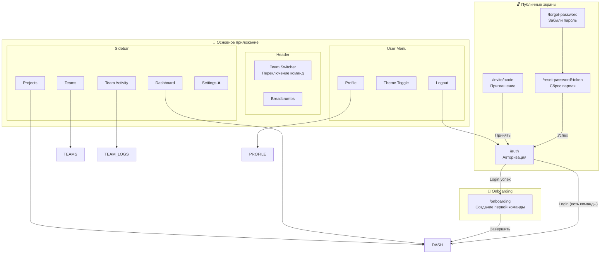
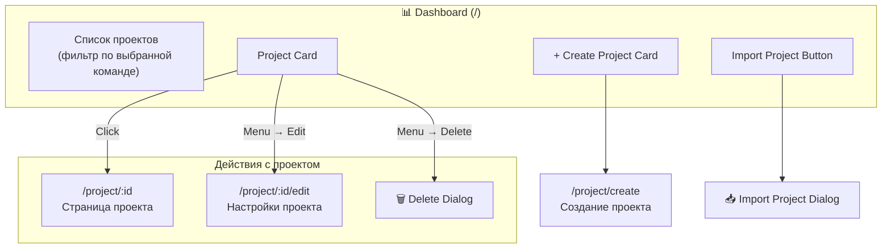
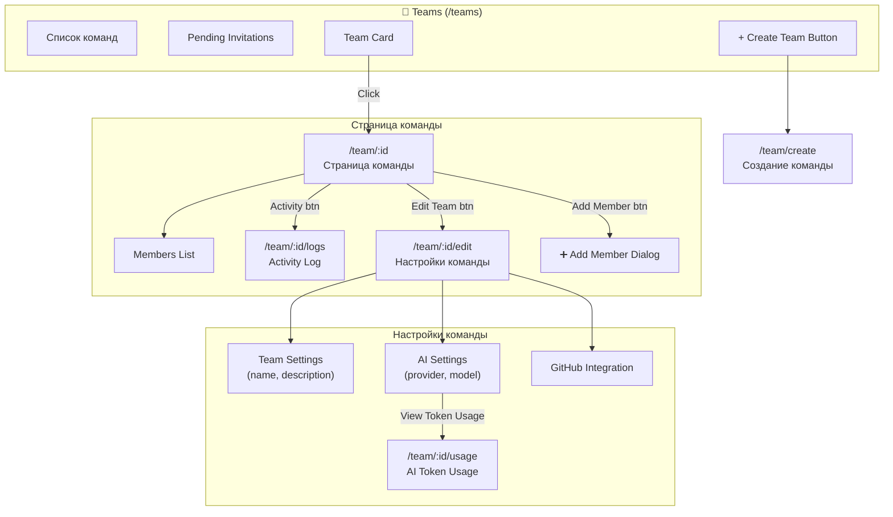
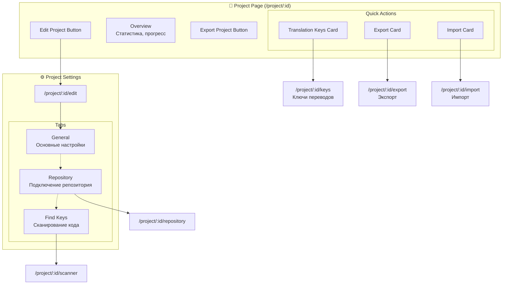
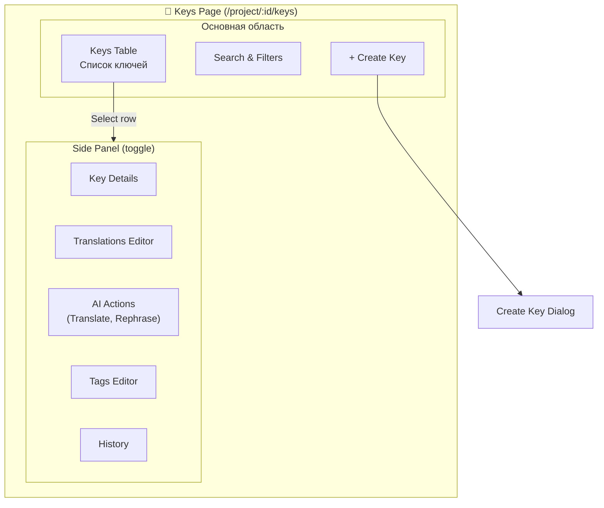
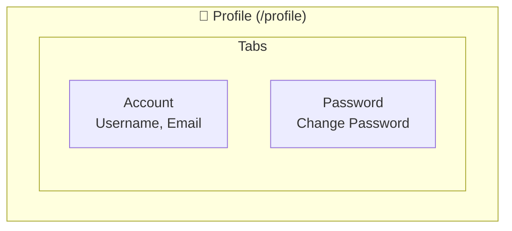

# Keeys Navigation Map

> Этот документ описывает полную структуру навигации приложения Keeys для анализа UX.

## Оглавление

1. [Обзор структуры](#обзор-структуры)
2. [Блок-схема навигации](#блок-схема-навигации)
3. [Детальное описание экранов](#детальное-описание-экранов)
4. [Способы навигации](#способы-навигации)
5. [Диалоговые окна](#диалоговые-окна)
6. [Проблемные зоны UX](#проблемные-зоны-ux)

---

## Обзор структуры

### Иерархия сущностей

```
User
└── Team (много)
    ├── AI Settings (provider, model)
    ├── GitHub Integration
    ├── Members (invites, roles)
    └── Project (много)
        ├── Languages Configuration
        ├── Repository Connection
        └── Translation Keys (много)
            └── Translations (по языкам)
```

### Основные разделы

| Раздел | Путь | Описание |
|--------|------|----------|
| Auth | `/auth` | Авторизация/Регистрация |
| Dashboard | `/` | Список проектов (в контексте выбранной команды) |
| Teams | `/teams` | Управление командами |
| Team | `/team/:id` | Страница команды |
| Project | `/project/:id` | Страница проекта |
| Profile | `/profile` | Настройки профиля |

---

## Блок-схема навигации

### Главная диаграмма



### Dashboard Flow



### Teams Flow



### Project Flow



### Keys Page Flow



### Profile Flow



---

## Детальное описание экранов

### 1. Auth Flow (Публичные)

| Экран | Путь | Элементы | Переходы |
|-------|------|----------|----------|
| **Auth Page** | `/auth` | Login Form, Register Form, Switch toggle | → Forgot Password, → Dashboard/Onboarding |
| **Forgot Password** | `/forgot-password` | Email input, Submit | → Reset Password |
| **Reset Password** | `/reset-password/:token` | New password inputs | → Auth |
| **Invite Page** | `/invite/:code` | Invitation info, Accept/Decline | → Auth (register/login) |

### 2. Onboarding

| Экран | Путь | Элементы | Переходы |
|-------|------|----------|----------|
| **Onboarding** | `/onboarding` | Wizard steps (Create Team) | → Dashboard |

### 3. Dashboard

| Экран | Путь | Элементы | Переходы |
|-------|------|----------|----------|
| **Dashboard** | `/` | Project cards grid, Create card, Import button | → Project, → Create Project, → Import Dialog |

### 4. Teams Section

| Экран | Путь | Элементы | Переходы |
|-------|------|----------|----------|
| **Teams List** | `/teams` | Team cards, Pending invites, Create button | → Team, → Create Team |
| **Team Page** | `/team/:id` | Members list, Activity btn, Edit btn, Add Member btn | → Team Logs, → Team Edit |
| **Team Edit** | `/team/:id/edit` | Team Settings form, AI Settings, GitHub Integration | → Team Usage |
| **Team Logs** | `/team/:id/logs` | Activity timeline | ← Team |
| **Team Usage** | `/team/:id/usage` | Token usage stats, Period selector | ← Team Edit |
| **Create Team** | `/team/create` | Team creation form | → Team |

### 5. Project Section

| Экран | Путь | Элементы | Переходы |
|-------|------|----------|----------|
| **Project Page** | `/project/:id` | Overview, Quick Actions (Keys/Export/Import), Edit btn | → Keys, → Export, → Import, → Edit |
| **Project Keys** | `/project/:id/keys` | Keys table, Side panel, Create Key btn | → Create Key Dialog |
| **Project Edit** | `/project/:id/edit` | Tabs: General, Repository, Scanner | → Repository, → Scanner |
| **Project Repository** | `/project/:id/repository` | GitHub repo connection | → Scanner |
| **Project Scanner** | `/project/:id/scanner` | Repository scanning for keys | ← Repository (if no repo connected) |
| **Export** | `/project/:id/export` | Export settings, Download | ← Project |
| **Import** | `/project/:id/import` | File upload, Import preview | ← Project |
| **Create Project** | `/project/create` | Project creation form | → Project |

### 6. Profile

| Экран | Путь | Элементы | Переходы |
|-------|------|----------|----------|
| **Profile** | `/profile` | Tabs: Account, Password | - |

---

## Способы навигации

### 1. Sidebar (постоянно виден)

```
┌─────────────────┐
│ 🌐 Keeys (Logo) │ → Dashboard
├─────────────────┤
│ 📊 Dashboard    │ → /
│ 👥 Teams        │ → /teams
│ 📋 Team Activity│ → /team/:selectedId/logs
│ 📁 Projects     │ → / (same as Dashboard)
│ ⚙️ Settings     │ → # (disabled)
├─────────────────┤
│ 👤 User Menu    │ → Dropdown
│    ├─ Profile   │ → /profile
│    ├─ Theme     │ → Toggle
│    └─ Logout    │ → /auth
└─────────────────┘
```

### 2. Header

```
┌─────────────────────────────────────────────┐
│ [Team Switcher ▼]  Dashboard / Project Name │
│                                    [Panel ▶]│
└─────────────────────────────────────────────┘
```

- **Team Switcher**: Dropdown для переключения между командами + "Create Team"
- **Breadcrumbs**: Навигация по иерархии страниц
- **Panel Toggle**: Показать/скрыть боковую панель (только на /project/:id/keys)

### 3. Breadcrumbs (примеры)

| Страница | Breadcrumbs |
|----------|-------------|
| Dashboard | `Dashboard` |
| Teams | `Teams` |
| Team | `Teams / Team Name` |
| Team Edit | `Teams / Team Name / Edit` |
| Team Logs | `Teams / Team Name / Activity` |
| Project | `Dashboard / Project Name` |
| Project Keys | `Dashboard / Project Name / Keys` |
| Project Edit | `Dashboard / Project Name / Settings` |
| Export | `Dashboard / Project Name / Export` |
| Profile | `Profile` |

### 4. Контекстные кнопки

| Страница | Кнопки | Действия |
|----------|--------|----------|
| Team Page | Activity, Edit Team, Add Member | Навигация/Диалог |
| Team Edit | Cancel, Save, View Token Usage | Навигация/Сохранение |
| Project Page | Export Project, Edit Project | Экспорт/Навигация |
| Project Page | Quick Action Cards | Навигация |
| Project Keys | Create Key, Panel Toggle | Диалог/Toggle |
| Project Edit | Tabs (General/Repository/Scanner) | Навигация между tabs |

---

## Диалоговые окна

| Диалог | Где вызывается | Назначение |
|--------|----------------|------------|
| **Login Form** | Auth Page | Вход в систему |
| **Register Form** | Auth Page | Регистрация |
| **Import Project Dialog** | Dashboard | Импорт проекта из JSON |
| **Delete Project Dialog** | Dashboard (Project card menu) | Подтверждение удаления |
| **Add Member Dialog** | Team Page | Приглашение в команду |
| **Create Key Dialog** | Project Keys Page | Создание нового ключа |
| **Delete Key Dialog** | Project Keys (Side Panel) | Удаление ключа |

---

## Проблемные зоны UX

### 1. Дублирование навигации

- **Dashboard** и **Projects** в sidebar ведут на один и тот же экран (`/`)
- **Settings** в sidebar неактивен (disabled)

### 2. Скрытая навигация

- **Team Usage** (`/team/:id/usage`) доступен только через Edit Team → AI Settings → "View Token Usage"
- **Project Scanner** требует сначала подключить Repository

### 3. Контекстная зависимость

- **Team Activity** в sidebar зависит от выбранной команды в Team Switcher
- Если команда не выбрана, пункт не отображается

### 4. Глубокая вложенность

- Чтобы попасть в **Find Keys** (сканирование кода):
  `Dashboard → Project → Edit → Repository Tab → Connect GitHub → Scanner Tab`

### 5. Неочевидные переходы

- **Export** доступен двумя способами:
  1. Quick Action card на Project Page
  2. Кнопка "Export Project" (скачивает напрямую без перехода)
  
- **Team Edit** доступен только если `canManage=true`

### 6. Отсутствующие shortcut-ы

- Нет быстрого доступа к конкретному проекту из Team Page
- Нет поиска по всем проектам/командам
- Нет клавиатурных shortcuts

---

## Рекомендации для UX анализа

1. **Упростить доступ к частым действиям**:
   - Team Activity → вынести на уровень Team Page
   - Token Usage → добавить в Team Page (не только в Edit)

2. **Уменьшить дублирование**:
   - Объединить Dashboard и Projects или дать им разное назначение
   - Активировать Settings или убрать

3. **Улучшить discoverability**:
   - Scanner/Repository - показать статус на Project Page
   - AI Settings - показать current model на Team Page

4. **Добавить shortcuts**:
   - Cmd+K для глобального поиска
   - Quick switch между проектами

5. **Breadcrumbs enhancement**:
   - Кликабельные промежуточные элементы
   - Dropdown для siblings (другие проекты, другие команды)

---

*Документ создан: декабрь 2024*
*Версия: 1.0*

